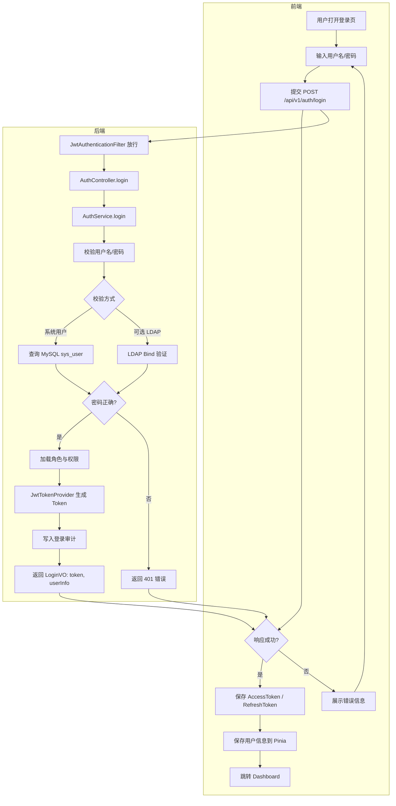
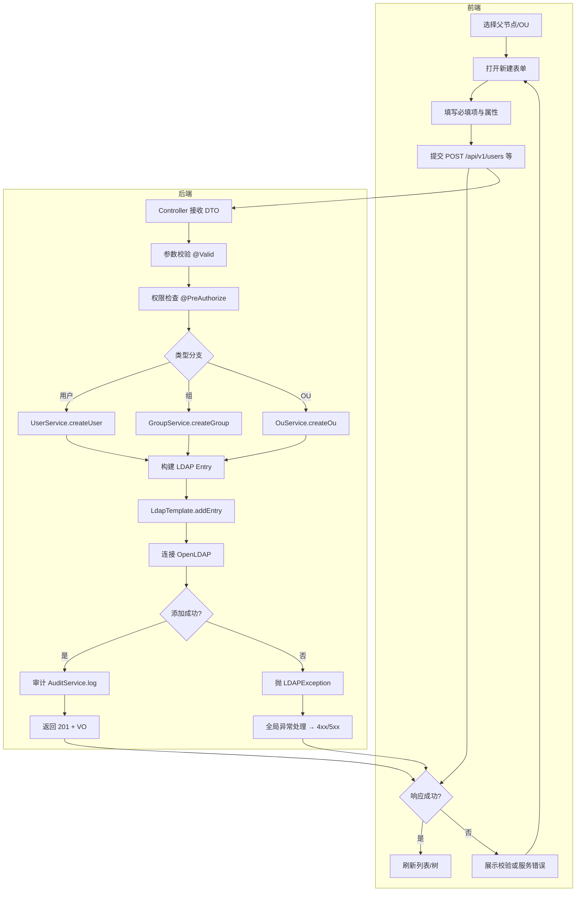
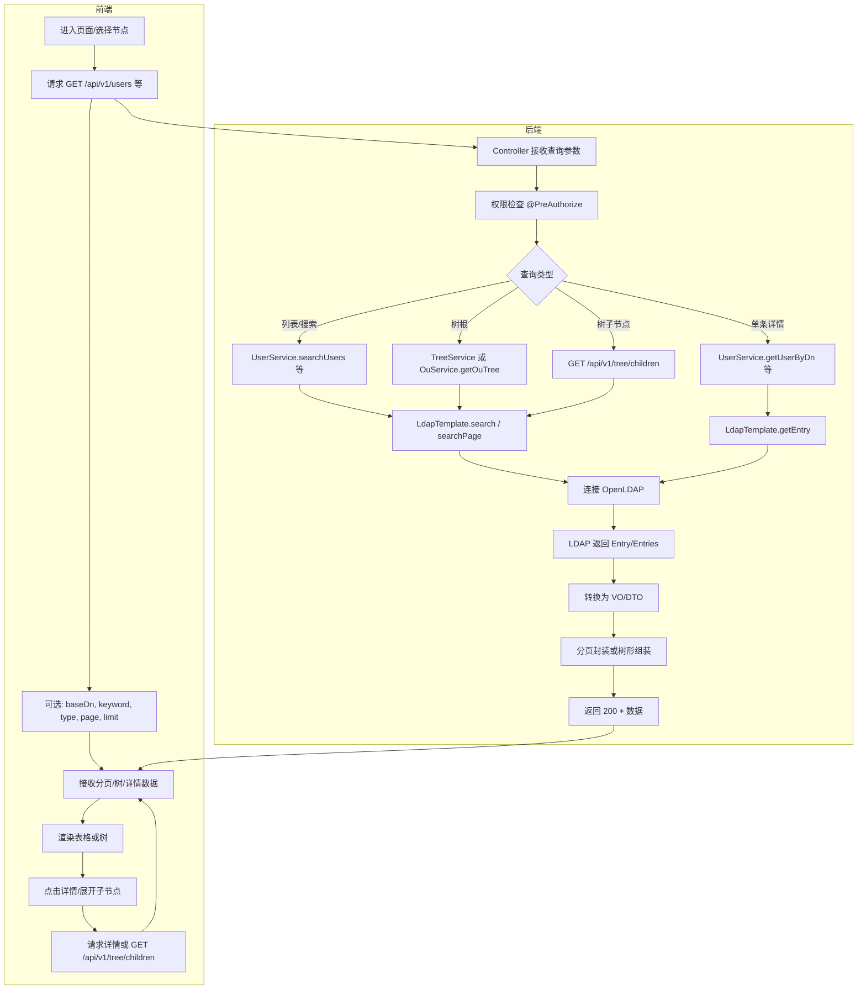
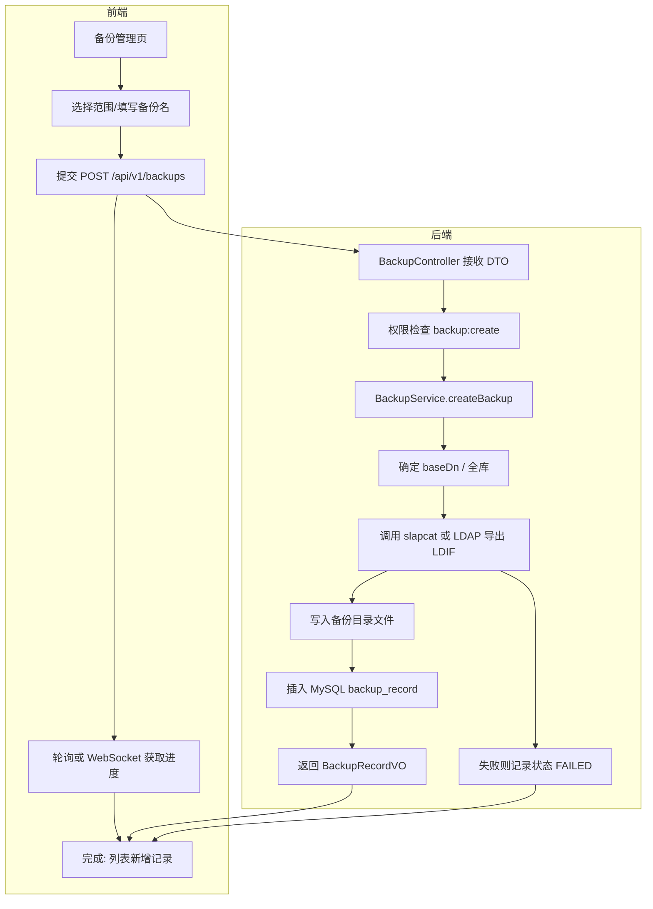
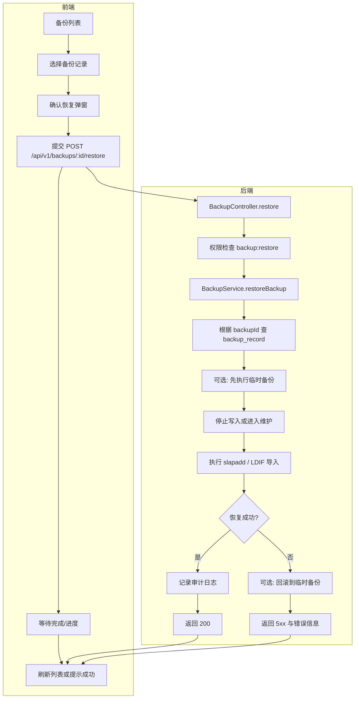

# OpenLDAP 运维管理系统架构设计

## 文档概述

本文档描述基于 **OpenLDAP** 的 LDAP 运维管理系统的架构与设计，用于指导后端（Java + Spring Boot + Maven）与前端（Vue 3）的开发与实现。系统围绕以下三大核心能力展开：

1. **LDAP 权限配置**：通过 Web 界面配置与管理 OpenLDAP 的 ACI/ACL，控制目录数据的访问权限。
2. **LDAP 数据运维**：对目录中的用户、组、OU 等条目进行增删改查、批量导入导出、密码重置等操作。
3. **主从同步配置**：配置与管理 OpenLDAP 的 Syncrepl 主从复制，包括消费者配置与同步状态查看。

文档结构：技术栈与架构图 → **关键业务流程图**（登录、数据添加、数据查询、备份恢复）→ 后端/前端模块设计 → 数据库与 DIT 设计 → API 设计 → 技术实现细节（含 ACI、Syncrepl）→ 实施计划与关键文件。

---

## 设计目标

* 管理元数据落本地数据库，业务目录数据仍以 LDAP 为准
* **支持多实例、多环境、多后缀（suffix）统一管理**。
* 

## 系统核心功能

本系统专注于 OpenLDAP 服务器的运维管理，核心功能包括：

| 核心功能 | 说明 |
|---------|------|
| **LDAP 权限配置** | 通过可视化界面配置 ACI/ACL，控制条目访问权限 |
| **LDAP 数据 CRUD** | 对用户、组、OU 等 LDAP 条目进行增删改查操作 |
| **主从同步配置** | 配置和管理 OpenLDAP 的主从同步 (Syncrepl) |

---

## 1. 技术栈

| 组件 | 技术选型 |
|------|---------|
| 后端框架 | Spring Boot 2.7.x + Java 8 |
| 构建工具 | Maven |
| LDAP SDK | UnboundID LDAP SDK 6.0.11 |
| 安全框架 | Spring Security 5.7.x + JWT |
| 数据库 | MySQL 8.0 |
| 前端框架 | Vue 3 + TypeScript |
| 前端构建 | Vite |
| UI 组件库 | Element Plus |
| 状态管理 | Pinia |
| 路由管理 | Vue Router 4 |
| API文档 | Swagger / Knife4j |

---

## 2. 系统架构图

```
┌─────────────────────────────────────────────────────────────────────────────┐
│                              客户端层 (Client Layer)                         │
│  ┌──────────────┐  ┌──────────────┐  ┌──────────────┐  ┌──────────────┐     │
│  │   浏览器      │  │  移动端应用   │  │  CLI 工具    │  │  API 客户端   │     │
│  └──────────────┘  └──────────────┘  └──────────────┘  └──────────────┘     │
└────────────────────────────┬────────────────────────────────────────────────┘
                             │ HTTPS / WebSocket
┌────────────────────────────┴────────────────────────────────────────────────┐
│                           前端应用层 (Frontend Layer)                         │
│  ┌──────────────────────────────────────────────────────────────────────┐   │
│  │  Vue 3 + TypeScript + Vite + Element Plus                            │   │
│  │  ═════════════════════════ 核心功能模块 ════════════════════════   │   │
│  │  ┌─────────────┐  ┌─────────────┐  ┌─────────────┐  ┌─────────────┐  │   │
│  │  │ LDAP数据管理 │  │ LDAP权限配置  │  │ 主从同步配置  │  │ 审计日志     │  │   │
│  │  │ [核心功能]  │  │ [核心功能]   │  │ [核心功能]   │  │              │  │   │
│  │  └─────────────┘  └─────────────┘  └─────────────┘  └─────────────┘  │   │
│  │  ┌─────────────┐  ┌─────────────┐  ┌─────────────┐  ┌─────────────┐  │   │
│  │  │ 用户管理     │  │ 组管理       │  │ OU管理       │  │ 系统设置     │  │   │
│  │  └─────────────┘  └─────────────┘  └─────────────┘  └─────────────┘  │   │
│  │  ┌─────────────────────────────────────────────────────────────────┐  │   │
│  │  │  状态管理: Pinia │  路由管理: Vue Router │  HTTP客户端: Axios  │  │   │
│  │  └─────────────────────────────────────────────────────────────────┘  │   │
│  └──────────────────────────────────────────────────────────────────────┘   │
└────────────────────────────┬────────────────────────────────────────────────┘
                             │ RESTful API / WebSocket
┌────────────────────────────┴────────────────────────────────────────────────┐
│                           API 网关层 (API Gateway)                          │
│  ┌──────────────────────────────────────────────────────────────────────┐   │
│  │  Spring Boot 2.7.x + Spring Security 5.7.x                                │   │
│  │  ┌──────────────┐  ┌──────────────┐  ┌──────────────┐              │   │
│  │  │ JWT 认证     │  │ 权限验证     │  │ 限流控制     │              │   │
│  │  └──────────────┘  └──────────────┘  └──────────────┘              │   │
│  │  ┌──────────────┐  ┌──────────────┐  ┌──────────────┐              │   │
│  │  │ 请求日志     │  │ 异常处理     │  │ CORS 配置    │              │   │
│  │  └──────────────┘  └──────────────┘  └──────────────┘              │   │
│  └──────────────────────────────────────────────────────────────────────┘   │
└────────────────────────────┬────────────────────────────────────────────────┘
                             │
┌────────────────────────────┴────────────────────────────────────────────────┐
│                           业务服务层 (Service Layer)                         │
│  ┌──────────────────────────────────────────────────────────────────────┐   │
│  │  ═════════════════════════ 核心服务模块 ════════════════════════   │   │
│  │  ┌─────────────────┐  ┌─────────────────┐  ┌─────────────────┐        │   │
│  │  │  LDAP 数据服务    │  │  ACI/ACL配置服务 │  │  同步配置服务    │        │   │
│  │  │  LdapDataService │  │  AclService      │  │  SyncService     │        │   │
│  │  └─────────────────┘  └─────────────────┘  └─────────────────┘        │   │
│  │  ┌─────────────────┐  ┌─────────────────┐  ┌─────────────────┐        │   │
│  │  │  用户服务        │  │  组服务          │  │  OU服务          │        │   │
│  │  │  UserService     │  │  GroupService    │  │  OuService       │        │   │
│  │  └─────────────────┘  └─────────────────┘  └─────────────────┘        │   │
│  │  ┌─────────────────┐  ┌─────────────────┐  ┌─────────────────┐        │   │
│  │  │  审计服务        │  │  认证服务        │  │  系统配置服务    │        │   │
│  │  │  AuditService    │  │  AuthService     │  │  ConfigService   │        │   │
│  │  └─────────────────┘  └─────────────────┘  └─────────────────┘        │   │
│  └──────────────────────────────────────────────────────────────────────┘   │
└────────────────────────────┬────────────────────────────────────────────────┘
                             │
┌────────────────────────────┴────────────────────────────────────────────────┐
│                           数据访问层 (Data Access Layer)                     │
│  ┌──────────────────────────────────────────────────────────────────────┐   │
│  │  ┌─────────────────┐  ┌─────────────────┐  ┌─────────────────┐        │   │
│  │  │  LDAP 数据访问   │  │  MySQL 数据访问  │  │  缓存层         │        │   │
│  │  │ LdapRepository  │  │ JPA Repository  │  │ Redis/Caffeine  │        │   │
│  │  │ UnboundID SDK   │  │ Spring Data JPA │  │                 │        │   │
│  │  └─────────────────┘  └─────────────────┘  └─────────────────┘        │   │
│  └──────────────────────────────────────────────────────────────────────┘   │
└────────────────────────────┬────────────────────────────────────────────────┘
                             │
┌────────────────────────────┴────────────────────────────────────────────────┐
│                           数据存储层 (Data Storage Layer)                    │
│  ┌─────────────────────────────────────────────────────────────────────────┐│
│  │              OpenLDAP Server (主)        │  OpenLDAP Server (从)      ││
│  │                    ◄══════════════ Syncrepl═════════════►                ││
│  └─────────────────────────────────────────────────────────────────────────┘│
│  ┌─────────────────────────────────────────────────────────────────────────┐│
│  │                        MySQL 8.0 (系统配置/审计日志)                     ││
│  └─────────────────────────────────────────────────────────────────────────┘│
└─────────────────────────────────────────────────────────────────────────────┘
```

---

## 2.5 关键业务流程图

以下流程图基于当前设计，描述系统登录、数据添加、数据查询、数据备份与恢复等关键业务的端到端流程。

### 2.5.1 系统登录流程



**说明**：登录使用系统用户表（MySQL）校验；可选扩展为 LDAP Bind 或双因素认证。Token 用于后续请求头 `Authorization: Bearer <token>`。

---

### 2.5.2 数据添加流程（用户/组/OU）



**说明**：添加前需已登录且具备对应资源权限（如 `user:create`）。Entry 由服务层按 objectClass 与 DIT 规范构建，再通过 LdapTemplate 写入 OpenLDAP，成功后写审计日志。

---

### 2.5.3 数据查询流程（列表/树/详情）



**说明**：查询统一经权限校验后，由对应 Service 调用 LdapTemplate 的 search/searchPage/getEntry，结果转换为前端 VO，列表分页、树形懒加载按 API 约定返回。

---

### 2.5.4 数据备份流程



**说明**：备份通过 slapcat 或 SDK 导出 LDIF 到指定目录，并在 MySQL 记录 backup_record，便于后续恢复与过期清理。

---

### 2.5.5 数据恢复流程



**说明**：恢复前可先做一次临时备份以便回滚；恢复过程需考虑 slapd 停写或维护窗口，实际操作依赖部署方式（本机 slapadd 或运维脚本）。

---

### 2.5.6 流程图汇总

| 流程       | 关键入口                     | 关键服务/组件              |
|------------|------------------------------|----------------------------|
| 系统登录   | POST /api/v1/auth/login     | AuthService, JwtTokenProvider |
| 数据添加   | POST /api/v1/users、groups、ous | User/Group/OuService, LdapTemplate |
| 数据查询   | GET /api/v1/users、tree、ous 等 | 各 Service.search*/get*, LdapTemplate |
| 数据备份   | POST /api/v1/backups        | BackupService, slapcat/LDIF 导出 |
| 数据恢复   | POST /api/v1/backups/:id/restore | BackupService, slapadd/LDIF 导入 |

---

## 3. 后端模块设计

### 3.1 Maven 多模块项目结构

```
ldap-web-ui/
├── pom.xml                           # 父POM
│
├── ldap-web-ui-common/               # 公共模块 (常量、枚举、异常、DTO、VO、工具类)
├── ldap-web-ui-security/            # 安全模块 (Spring Security配置、JWT、过滤器)
├── ldap-web-ui-ldap/                # LDAP操作模块 (连接管理、模板、查询、转换器)
├── ldap-web-ui-api/                 # API模块 (Controller层)
├── ldap-web-ui-service/             # 服务模块 (Service接口及实现)
├── ldap-web-ui-repository/           # 数据访问模块 (JPA实体、JPA仓储、LDAP仓储)
├── ldap-web-ui-acl/                 # LDAP 权限模块 (ACI/ACL 配置、解析、应用)
├── ldap-web-ui-sync/                # 主从同步模块 (Syncrepl 配置与管理)
├── ldap-web-ui-approval/            # 审批模块 (流程引擎、配置、服务)
├── ldap-web-ui-scheduler/           # 定时任务模块 (备份任务等)
├── ldap-web-ui-notification/        # 通知模块 (邮件、短信、WebSocket)
└── ldap-web-ui-app/                 # 应用启动模块 (主启动类、配置文件)
```

### 3.2 核心服务接口

#### 用户服务 (UserService)
- `Page<UserVO> searchUsers(UserQueryDTO query)` - 分页查询用户
- `UserVO getUserByDn(String dn)` - 根据DN获取用户
- `UserVO createUser(UserCreateDTO dto)` - 创建用户
- `UserVO updateUser(String dn, UserUpdateDTO dto)` - 更新用户
- `void deleteUser(String dn)` - 删除用户
- `void resetPassword(String dn, String newPassword)` - 重置密码
- `void batchImport(List<UserImportDTO> users)` - 批量导入
- `byte[] exportUsers(List<String> dns)` - 导出用户

#### 组服务 (GroupService)
- `Page<GroupVO> searchGroups(GroupQueryDTO query)` - 分页查询组
- `GroupVO createGroup(GroupCreateDTO dto)` - 创建组
- `void addMembers(String groupDn, List<String> memberDns)` - 添加成员
- `void removeMembers(String groupDn, List<String> memberDns)` - 移除成员

#### OU服务 (OUService)
- `List<OuTreeNodeVO> getOuTree(String baseDn)` - 获取OU树
- `OuVO createOu(OuCreateDTO dto)` - 创建OU
- `void deleteOu(String dn, boolean recursive)` - 删除OU

#### 认证服务 (AuthService)
- `LoginVO login(LoginDTO dto)` - 登录
- `void logout(String token)` - 登出
- `LoginVO refreshToken(String refreshToken)` - 刷新Token

#### 审计服务 (AuditService)
- `Page<AuditLogVO> searchLogs(AuditQueryDTO query)` - 查询审计日志
- `Map<String, Long> getOperationStatistics(...)` - 操作统计

#### 审批服务 (ApprovalService)
- `ApprovalVO createApproval(ApprovalCreateDTO dto)` - 创建审批
- `ApprovalVO approve(Long approvalId, ApprovalActionDTO dto)` - 审批通过
- `ApprovalVO reject(Long approvalId, String reason)` - 审批拒绝

#### 备份服务 (BackupService)
- `BackupRecordVO createBackup(BackupCreateDTO dto)` - 创建备份
- `void restoreBackup(Long backupId)` - 恢复备份
- `void scheduleBackup(BackupScheduleDTO dto)` - 定时备份

#### LDAP 权限服务 (LdapAclService)
- `List<AclEntryVO> listAcl(String baseDn)` - 列出指定 DN 下的 ACI
- `AclEntryVO getAcl(String entryDn, String aclName)` - 获取单条 ACI
- `AclEntryVO createAcl(AclCreateDTO dto)` - 创建/添加 ACI
- `AclEntryVO updateAcl(String entryDn, String aclName, AclUpdateDTO dto)` - 更新 ACI
- `void deleteAcl(String entryDn, String aclName)` - 删除 ACI
- `void applyAclToSubtree(String baseDn, AclCreateDTO dto)` - 将 ACI 应用到子树
- `AclPreviewVO previewAcl(String aclString)` - 解析并预览 ACI 语义

#### 主从同步服务 (SyncReplService)
- `List<SyncReplConfigVO> listSyncReplConfigs()` - 列出所有 Syncrepl 配置
- `SyncReplConfigVO getSyncReplConfig(String consumerDn)` - 获取消费者配置
- `SyncReplConfigVO createConsumer(CreateConsumerDTO dto)` - 创建从节点配置
- `SyncReplConfigVO updateConsumer(String consumerDn, UpdateConsumerDTO dto)` - 更新从节点
- `void deleteConsumer(String consumerDn)` - 删除从节点配置
- `SyncReplStatusVO getSyncStatus(String consumerDn)` - 获取同步状态
- `void triggerRefresh(String consumerDn)` - 触发立即刷新

---

## 4. 前端模块设计

### 4.1 项目结构

```
src/
├── views/                       # 页面视图
│   ├── login/                   # 登录
│   ├── dashboard/               # 仪表盘
│   ├── user/                    # 用户管理 (列表、详情、表单、密码、导入)
│   ├── group/                   # 组管理 (列表、详情、表单、成员管理)
│   ├── ou/                      # OU管理 (树形视图、详情、表单)
│   ├── audit/                   # 审计日志 (列表、详情、统计)
│   ├── approval/                # 审批管理 (待审批、历史、详情)
│   ├── backup/                  # 备份恢复 (列表、创建、定时备份)
│   ├── batch/                   # 批量操作 (列表、创建、详情)
│   ├── acl/                     # LDAP 权限 (ACI 列表、编辑、预览、应用到子树)
│   ├── sync/                    # 主从同步 (消费者列表、配置、状态、触发刷新)
│   ├── system/                  # 系统管理 (角色、权限、管理员、设置)
│   └── profile/                 # 个人中心 (信息、安全设置)
│
├── components/                  # 组件
│   ├── layout/                 # 布局组件 (AppLayout、Header、Sidebar等)
│   ├── user/                   # 用户组件 (UserTable、UserForm等)
│   ├── group/                  # 组组件 (GroupTable、MemberSelector等)
│   ├── ou/                     # OU组件 (OuTree、OuBreadcrumb等)
│   ├── audit/                  # 审计组件 (AuditLogTable、AuditChart等)
│   ├── approval/               # 审批组件 (ApprovalFlow、ApprovalDialog等)
│   ├── acl/                    # 权限组件 (AclEditor、AclPreview、AclTree等)
│   ├── sync/                   # 同步组件 (SyncReplTable、ConsumerForm、SyncStatusCard等)
│   └── common/                 # 通用组件 (DataTable、SearchPanel、ConfirmDialog等)
│
├── stores/                     # 状态管理 (Pinia)
│   ├── auth.ts                # 认证状态
│   ├── ldap.ts                # LDAP状态
│   ├── audit.ts               # 审计状态
│   ├── approval.ts            # 审批状态
│   └── app.ts                 # 应用状态
│
├── router/                     # 路由配置
│   └── modules/               # 路由模块
│
├── api/                        # API接口
│   ├── auth.ts, user.ts, group.ts, ou.ts, audit.ts, approval.ts, backup.ts, acl.ts, sync.ts, system.ts
│
├── composables/                # 组合式函数
│   ├── useTable.ts, useForm.ts, useDialog.ts, usePermission.ts, useLdap.ts, useExport.ts
│
├── utils/                      # 工具函数
│   ├── request.ts, auth.ts, validate.ts, format.ts, ldap.ts
│
├── types/                      # 类型定义
│   ├── user.ts, group.ts, ou.ts, auth.ts, audit.ts, approval.ts, api.ts, global.ts
│
└── constants/                  # 常量定义
    └── ldap.ts, audit.ts, approval.ts, common.ts
```

### 4.2 路由设计 (部分)

| 路径 | 组件 | 权限 |
|------|------|------|
| `/login` | 登录页 | - |
| `/dashboard` | 仪表盘 | - |
| `/user/list` | 用户列表 | `user:view` |
| `/user/create` | 创建用户 | `user:create` |
| `/user/:dn/detail` | 用户详情 | `user:view` |
| `/group/list` | 组列表 | `group:view` |
| `/ou/tree` | OU树形视图 | `ou:view` |
| `/audit/log` | 审计日志 | `audit:view` |
| `/approval/pending` | 待审批 | `approval:approve` |
| `/backup/list` | 备份列表 | `backup:view` |
| `/acl` | ACI 权限配置 | `acl:view` |
| `/acl/:baseDn` | 指定 DN 的 ACI | `acl:edit` |
| `/sync/consumers` | 主从同步配置 | `sync:view` |
| `/sync/consumers/:dn/status` | 同步状态 | `sync:view` |

---

## 4.3 树形数据展示设计

### 4.3.1 树形组件设计 (LdapTree)

#### 功能需求
- 支持多层级 LDAP 条目树形展示（用户、组、OU）
- 动态加载/懒加载，按需加载子节点
- 节点类型区分：OU、用户、组、其他自定义对象类
- 节点操作：展开/收起、右键菜单、拖拽（可选）
- 虚拟滚动，支持大规模数据渲染

#### 数据结构

```typescript
// 树节点接口
interface LdapTreeNode {
  id: string;                    // 唯一标识，使用 DN
  dn: string;                    // LDAP 专有名称
  label: string;                  // 显示名称 (cn、ou 等)
  type: 'ou' | 'user' | 'group' | 'other';  // 节点类型
  objectClass: string[];           // LDAP 对象类
  hasChildren: boolean;           // 是否有子节点
  isLeaf: boolean;               // 是否为叶子节点
  icon?: string;                 // 自定义图标
  children?: LdapTreeNode[];      // 子节点（懒加载时初始为空）
  attributes?: Record<string, any>;  // 节点属性
  meta?: {
    entryCount?: number;          // 子条目数量
    lastModified?: string;        // 最后修改时间
    hasAcl?: boolean;           // 是否配置了权限
  };
}
```

#### 动态加载策略

**策略一：基于展开的懒加载**
- 节点初始只加载一级子节点
- 用户展开节点时，动态请求该节点下的子节点
- 收起节点时，可选清空已加载的子节点数据

**策略二：分页加载**
- 节点子节点数量较多时，支持分页加载
- 每页加载固定数量（如 100 条）
- 提供"加载更多"按钮在树节点底部

**策略三：搜索过滤 + 动态加载**
- 搜索时仅返回匹配节点及其祖先路径
- 搜索结果支持虚拟滚动
- 点击搜索结果后，动态加载该路径上的节点

#### API 设计

```
# 获取根节点（一级 OU）
GET    /api/v1/tree/roots

# 获取指定节点的子节点（懒加载）
GET    /api/v1/tree/children?parentDn={dn}&page=1&limit=100

# 搜索树节点
GET    /api/v1/tree/search?keyword={keyword}&type={ou|user|group}

# 获取节点路径（用于定位）
GET    /api/v1/tree/path?dn={dn}
```

#### 组件实现要点

```typescript
// 使用 Element Plus Tree 组件
<el-tree
  :data="treeData"
  :props="treeProps"
  :load="loadNode"
  lazy
  :filter-node-method="filterNode"
  :expand-on-click-node="false"
  :highlight-current="true"
  @node-click="handleNodeClick"
  @node-contextmenu="handleContextMenu"
>
  <template #default="{ node, data }">
    <span class="tree-node-content">
      <i :class="getNodeIcon(node)"></i>
      <span class="node-label">{{ data.label }}</span>
      <span v-if="data.meta?.entryCount" class="node-count">
        ({{ data.meta.entryCount }})
      </span>
    </span>
  </template>
</el-tree>

// 动态加载方法
const loadNode = async (node: TreeNode, resolve: Function) => {
  if (node.isLeaf) {
    resolve([]);
    return;
  }

  if (!node.loaded) {
    const { data } = await api.getTreeChildren(node.data.dn);
    node.children = data.children;
    node.loaded = true;
    resolve(data.children);
  } else {
    resolve(node.children);
  }
};
```

#### 性能优化

| 优化项 | 实现方式 |
|--------|----------|
| 虚拟滚动 | 使用 `el-tree-v2` 或自定义虚拟滚动 |
| 节点缓存 | 已加载节点数据缓存，避免重复请求 |
| 请求防抖 | 快速展开/收起时进行防抖处理 |
| 数据预加载 | 预测用户行为，预加载可能的子节点 |
| 增量加载 | 初始加载一级节点，后续按需加载 |

---

## 4.4 页面布局设计

### 4.4.1 整体布局架构

```
┌─────────────────────────────────────────────────────────────────────────────────────┐
│  顶部导航栏 (Header)                                                             │
│  ┌───────────────────────────────────────────────────────────────────────────────┐ │
│  │ Logo  │  面包屑  │  标题  │  操作栏  │  搜索  │  通知  │  用户头像 │ │ │
│  └───────────────────────────────────────────────────────────────────────────────┘ │
├─────────────────┬───────────────────────────────────────────────────────────────────┤
│                 │                                                                   │
│  侧边栏        │                      主内容区 (Main Content)                  │
│  (Sidebar)      │                                                                   │
│  ┌─────────────┐ │  ┌─────────────────────────────────────────────────────────────┐ │
│  │  LOGO       │ │  │                                                             │ │
│  │─────────────│ │  │  页面标题栏                                                   │ │
│  │ 导航菜单    │ │  │  ┌───────────────────────────────────────────────────────┐  │ │
│  │  ══════════│ │  │  │  标题  │  操作按钮组 │  筛选器 │  快捷操作   │  │  │ │
│  │  ║ 功能菜单  │ │  │  └───────────────────────────────────────────────┘  │ │ │
│  │  ║  ─────── │ │  │                                                             │ │
│  │  ║  ┌──────┐ │  │  ┌───────────────────────────────────────────────────────┐  │ │
│  │  ║  │ 树形  │ │  │  │                                                         │  │ │
│  │  ║  │ 导航  │ │  │  │  树形视图区 (树形展示 LDAP 数据)                    │  │ │
│  │  ║  │      │ │  │  │  ┌──────────────────────────────────────────────────┐ │  │ │
│  │  ║  │      │ │  │  │  │ • 动态加载                                      │ │  │ │
│  │  ║  │ OU树  │ │  │  │  │ • 懒加载展开                                    │ │  │ │
│  │  ║  │      │ │  │  │  │ • 搜索过滤                                      │ │  │ │
│  │  ║  │      │ │  │  │  │ • 右键菜单                                      │ │  │ │
│  │  ║  │ 用户树│ │  │  │  │ • 拖拽排序 (可选)                              │ │  │ │
│  │  ║  │      │ │  │  │  └──────────────────────────────────────────────────┘ │  │ │
│  │  ║  │      │ │  │  │                                                         │  │ │
│  │  ║  │ 组树  │ │  │  └───────────────────────────────────────────────────────┘  │ │ │
│  │  ║  │      │ │  │                                                             │ │ │
│  │  ║  │      │ │  │  ┌───────────────────────────────────────────────────────┐  │ │
│  │  ║  ─────── │ │  │  │  详细内容区 (表格/表单/详情)                        │  │ │
│  │  ║          │ │  │  │  ┌───────────────────────────────────────────────────┐ │  │ │
│  │  ║  快捷操作  │ │  │  │  │  ┌─────────────┐  ┌─────────────┐  ┌───────────┐│ │  │ │
│  │  ║  ════════│ │  │  │  │  │ 搜索/筛选   │  │  数据表格    │  │  操作面板  │ │ │  │ │
│  │  ║  │  • 新建  │ │  │  │  │  └─────────────┘  └─────────────┘  └───────────┘│ │  │ │
│  │  ║  │  • 刷新  │ │  │  │  └───────────────────────────────────────────────────┘ │  │ │
│  │  ║  │  • 导入  │ │  │  │  ┌───────────────────────────────────────────────────┐  │ │ │
│  │  ║  │  • 导出  │ │  │  │  │  详情表单 (选中节点详细信息)                    │  │ │ │
│  │  ║  │          │ │  │  │  └───────────────────────────────────────────────────┘ │  │ │
│  │  ║          │ │  │  │                                                         │  │ │
│  │  └─────────────┘ │  └───────────────────────────────────────────────────────┘ │ │
│  └─────────────┘                                                                   │
└─────────────────┴───────────────────────────────────────────────────────────────────┘
```

### 4.4.2 左右分栏布局 (树形 + 表格)

适用于：用户管理、组管理等需要同时查看层级和列表的场景

**布局特点：**
- 左侧：可调整宽度的树形面板（20% - 35%）
- 右侧：自适应表格区域
- 中间：可拖拽的分割线
- 响应式：移动端默认收起树形面板

```typescript
<el-container>
  <el-aside :width="asideWidth" :style="{ minWidth: '200px', maxWidth: '500px' }">
    <!-- 树形组件 -->
    <div class="tree-toolbar">
      <el-input v-model="searchKeyword" placeholder="搜索..." @input="handleSearch" />
      <el-button-group>
        <el-button @click="refreshTree">刷新</el-button>
        <el-dropdown @command="handleTreeCommand">
          <el-button>更多</el-button>
          <template #dropdown>
            <el-dropdown-item command="expandAll">全部展开</el-dropdown-item>
            <el-dropdown-item command="collapseAll">全部收起</el-dropdown-item>
            <el-dropdown-item command="filterOu">仅显示 OU</el-dropdown-item>
          </template>
        </el-dropdown>
      </el-button-group>
    </div>
    <ldap-tree :data="treeData" :load="loadNode" lazy @node-click="handleNodeClick" />
  </el-aside>

  <el-resizer @resize="handleResize" direction="right" />

  <el-main>
    <!-- 表格组件 -->
    <data-table
      :data="tableData"
      :loading="loading"
      :selection="selectedItems"
      @selection-change="handleSelectionChange"
    />
  </el-main>
</el-container>
```

### 4.4.3 纯树形布局 (单页面)

适用于：OU 管理、全量数据浏览等场景

**布局特点：**
- 整页面为树形视图
- 顶部工具栏：搜索、筛选、批量操作
- 节点点击后右侧滑出详情面板
- 支持面包屑导航

```vue
<template>
  <div class="full-tree-layout">
    <!-- 顶部工具栏 -->
    <div class="tree-toolbar">
      <el-breadcrumb :separator-icon="ArrowRight">
        <el-breadcrumb-item v-for="item in breadcrumbs" :key="item.dn">
          {{ item.label }}
        </el-breadcrumb-item>
      </el-breadcrumb>
      <el-space class="toolbar-actions">
        <el-input v-model="searchText" placeholder="搜索节点..." />
        <el-select v-model="nodeTypeFilter" placeholder="类型筛选">
          <el-option label="全部" value="all" />
          <el-option label="OU" value="ou" />
          <el-option label="用户" value="user" />
          <el-option label="组" value="group" />
        </el-select>
        <el-button @click="handleBatchOperation">批量操作</el-button>
        <el-button @click="handleCreate">新建</el-button>
      </el-space>
    </div>

    <!-- 树形视图区域 -->
    <div class="tree-container">
      <ldap-virtual-tree
        :data="treeData"
        :height="treeHeight"
        :item-size="itemSize"
        @load="handleLoad"
      />
    </div>

    <!-- 右侧详情面板 -->
    <el-drawer v-model="detailVisible" direction="rtl" size="30%">
      <node-detail :node="selectedNode" @edit="handleEdit" @delete="handleDelete" />
    </el-drawer>
  </div>
</template>
```

### 4.4.4 页面组件结构

```
src/layouts/
├── AppLayout.vue           # 主布局容器
│   ├── AppHeader.vue        # 顶部导航栏
│   ├── AppSidebar.vue       # 侧边栏
│   ├── AppBreadcrumb.vue    # 面包屑
│   └── AppFooter.vue        # 底部
│
├── TreeSplitLayout.vue      # 左右分栏布局 (树 + 表格)
│   ├── TreePanel.vue         # 树形面板
│   ├── ResizeHandle.vue      # 拖拽分割手柄
│   └── ContentPanel.vue     # 内容面板
│
└── FullTreeLayout.vue       # 全树形布局
    ├── TreeToolbar.vue       # 树形工具栏
    ├── VirtualTree.vue       # 虚拟滚动树
    └── DetailDrawer.vue      # 详情抽屉
```

### 4.4.5 树形组件列表

```
src/components/tree/
├── LdapTree.vue            # 树形组件基础封装
├── LdapVirtualTree.vue      # 虚拟滚动树 (大数据量)
├── TreeToolbar.vue          # 树形工具栏
├── TreeNode.vue             # 树节点渲染组件
├── TreeFilter.vue           # 树形筛选组件
└── TreeContextMenu.vue      # 右键菜单组件
```

### 4.4.6 Composable 设计

```typescript
// composables/useLdapTree.ts
export function useLdapTree(options?: UseLdapTreeOptions) {
  const treeData = ref<LdapTreeNode[]>([]);
  const loading = ref(false);
  const expandedKeys = ref<string[]>([]);
  const selectedKey = ref<string>('');

  // 加载根节点
  const loadRoots = async () => {
    loading.value = true;
    try {
      const { data } = await api.getTreeRoots();
      treeData.value = data;
    } finally {
      loading.value = false;
    }
  };

  // 加载子节点（懒加载）
  const loadChildren = async (node: LdapTreeNode) => {
    if (node.loaded) return node.children || [];

    const { data } = await api.getTreeChildren(node.dn);
    node.children = data;
    node.loaded = true;
    return data;
  };

  // 搜索节点
  const searchNodes = async (keyword: string, type?: string) => {
    const { data } = await api.searchTreeNodes({ keyword, type });
    return data;
  };

  // 展开到指定节点
  const expandToNode = async (targetDn: string) => {
    const { data } = await api.getTreePath(targetDn);
    // 展开路径上的所有节点
    expandedKeys.value = data.map(n => n.dn);
    selectedKey.value = targetDn;
  };

  return {
    treeData,
    loading,
    expandedKeys,
    selectedKey,
    loadRoots,
    loadChildren,
    searchNodes,
    expandToNode
  };
}
```

### 4.4.7 页面组件结构

菜单结构至少包含：仪表盘、系统管理、审计中心、示例管理等

---

## 5. 数据库设计

### 5.1 MySQL 核心表结构

```sql
-- 系统用户表 (管理员)
CREATE TABLE sys_user (
    id BIGINT PRIMARY KEY AUTO_INCREMENT,
    username VARCHAR(50) NOT NULL UNIQUE,
    password VARCHAR(255) NOT NULL,
    real_name VARCHAR(100),
    email VARCHAR(100),
    status TINYINT DEFAULT 1,
    ldap_dn VARCHAR(255),
    created_at DATETIME NOT NULL DEFAULT CURRENT_TIMESTAMP,
    updated_at DATETIME NOT NULL DEFAULT CURRENT_TIMESTAMP ON UPDATE CURRENT_TIMESTAMP
);

-- 角色表
CREATE TABLE sys_role (
    id BIGINT PRIMARY KEY AUTO_INCREMENT,
    role_code VARCHAR(50) NOT NULL UNIQUE,
    role_name VARCHAR(100) NOT NULL,
    description VARCHAR(500),
    status TINYINT DEFAULT 1
);

-- 权限表
CREATE TABLE sys_permission (
    id BIGINT PRIMARY KEY AUTO_INCREMENT,
    parent_id BIGINT DEFAULT 0,
    permission_code VARCHAR(100) NOT NULL UNIQUE,
    permission_name VARCHAR(100) NOT NULL,
    resource_type VARCHAR(20) NOT NULL,  -- menu/button/api
    resource_path VARCHAR(255),
    http_method VARCHAR(10),
    icon VARCHAR(50),
    sort_order INT DEFAULT 0
);

-- 用户角色关联
CREATE TABLE sys_user_role (
    id BIGINT PRIMARY KEY AUTO_INCREMENT,
    user_id BIGINT NOT NULL,
    role_id BIGINT NOT NULL,
    UNIQUE KEY uk_user_role (user_id, role_id)
);

-- 角色权限关联
CREATE TABLE sys_role_permission (
    id BIGINT PRIMARY KEY AUTO_INCREMENT,
    role_id BIGINT NOT NULL,
    permission_id BIGINT NOT NULL,
    UNIQUE KEY uk_role_permission (role_id, permission_id)
);

-- 审计日志表 (分区表)
CREATE TABLE audit_log (
    id BIGINT PRIMARY KEY AUTO_INCREMENT,
    operation_type VARCHAR(50) NOT NULL,
    resource_type VARCHAR(50) NOT NULL,
    resource_dn VARCHAR(500),
    operator_id BIGINT NOT NULL,
    operator_name VARCHAR(100) NOT NULL,
    operation_time DATETIME NOT NULL,
    ip_address VARCHAR(50),
    old_value TEXT,
    new_value TEXT,
    status VARCHAR(20) NOT NULL,
    INDEX idx_operation_time (operation_time),
    INDEX idx_operator_id (operator_id)
) PARTITION BY RANGE (TO_DAYS(operation_time)) (...);

-- 审批记录表
CREATE TABLE approval_record (
    id BIGINT PRIMARY KEY AUTO_INCREMENT,
    approval_no VARCHAR(50) NOT NULL UNIQUE,
    title VARCHAR(200) NOT NULL,
    approval_type VARCHAR(50) NOT NULL,
    applicant_id BIGINT NOT NULL,
    target_dn VARCHAR(500),
    target_resource TEXT,
    status VARCHAR(20) NOT NULL DEFAULT 'PENDING',
    created_at DATETIME NOT NULL DEFAULT CURRENT_TIMESTAMP
);

-- 审批流程表
CREATE TABLE approval_flow (
    id BIGINT PRIMARY KEY AUTO_INCREMENT,
    approval_type VARCHAR(50) NOT NULL,
    flow_name VARCHAR(100) NOT NULL,
    flow_config TEXT NOT NULL,
    enabled TINYINT DEFAULT 1
);

-- 审批节点表
CREATE TABLE approval_node (
    id BIGINT PRIMARY KEY AUTO_INCREMENT,
    flow_id BIGINT NOT NULL,
    node_code VARCHAR(50) NOT NULL,
    node_name VARCHAR(100) NOT NULL,
    node_type VARCHAR(20) NOT NULL,
    node_order INT NOT NULL,
    approve_type VARCHAR(20),
    approve_value VARCHAR(500)
);

-- 审批历史表
CREATE TABLE approval_history (
    id BIGINT PRIMARY KEY AUTO_INCREMENT,
    approval_id BIGINT NOT NULL,
    node_id BIGINT,
    node_name VARCHAR(100),
    approver_id BIGINT NOT NULL,
    approver_name VARCHAR(100) NOT NULL,
    action VARCHAR(20) NOT NULL,
    comment TEXT,
    operated_at DATETIME NOT NULL DEFAULT CURRENT_TIMESTAMP
);

-- 备份记录表
CREATE TABLE backup_record (
    id BIGINT PRIMARY KEY AUTO_INCREMENT,
    backup_name VARCHAR(200) NOT NULL,
    backup_type VARCHAR(20) NOT NULL,
    backup_scope VARCHAR(50) NOT NULL,
    base_dn VARCHAR(500),
    file_path VARCHAR(500),
    file_size BIGINT,
    backup_time DATETIME NOT NULL,
    operator_id BIGINT NOT NULL,
    status VARCHAR(20) NOT NULL DEFAULT 'SUCCESS'
);

-- 备份计划表
CREATE TABLE backup_schedule (
    id BIGINT PRIMARY KEY AUTO_INCREMENT,
    schedule_name VARCHAR(200) NOT NULL,
    backup_type VARCHAR(20) NOT NULL,
    backup_scope VARCHAR(50) NOT NULL,
    base_dn VARCHAR(500),
    cron_expression VARCHAR(100) NOT NULL,
    retention_days INT DEFAULT 30,
    next_run_time DATETIME,
    status VARCHAR(20) NOT NULL DEFAULT 'ENABLED'
);

-- 批量操作表
CREATE TABLE batch_operation (
    id BIGINT PRIMARY KEY AUTO_INCREMENT,
    operation_name VARCHAR(200) NOT NULL,
    operation_type VARCHAR(50) NOT NULL,
    operation_config TEXT NOT NULL,
    total_count INT NOT NULL,
    success_count INT DEFAULT 0,
    failed_count INT DEFAULT 0,
    status VARCHAR(20) NOT NULL DEFAULT 'PENDING',
    operator_id BIGINT NOT NULL,
    created_at DATETIME NOT NULL DEFAULT CURRENT_TIMESTAMP
);

-- 批量操作明细表
CREATE TABLE batch_operation_detail (
    id BIGINT PRIMARY KEY AUTO_INCREMENT,
    batch_id BIGINT NOT NULL,
    sequence INT NOT NULL,
    target_dn VARCHAR(500),
    operation_data TEXT,
    status VARCHAR(20) NOT NULL,
    error_message TEXT,
    processed_at DATETIME
);

-- 系统配置表
CREATE TABLE sys_config (
    id BIGINT PRIMARY KEY AUTO_INCREMENT,
    config_key VARCHAR(100) NOT NULL UNIQUE,
    config_value TEXT,
    config_type VARCHAR(20) DEFAULT 'STRING',
    config_group VARCHAR(50),
    description VARCHAR(500)
);

-- LDAP ACI 配置快照表 (可选，用于审计与回滚)
CREATE TABLE ldap_aci_snapshot (
    id BIGINT PRIMARY KEY AUTO_INCREMENT,
    entry_dn VARCHAR(500) NOT NULL,
    aci_name VARCHAR(200),
    aci_value TEXT NOT NULL,
    snapshot_type VARCHAR(20) NOT NULL DEFAULT 'CURRENT',
    operator_id BIGINT,
    created_at DATETIME NOT NULL DEFAULT CURRENT_TIMESTAMP,
    INDEX idx_entry_dn (entry_dn(255))
);

-- 主从同步配置表 (本系统管理的消费者配置)
CREATE TABLE ldap_sync_consumer (
    id BIGINT PRIMARY KEY AUTO_INCREMENT,
    consumer_name VARCHAR(200) NOT NULL,
    consumer_dn VARCHAR(500) NOT NULL UNIQUE,
    provider_uri VARCHAR(500) NOT NULL,
    bind_dn VARCHAR(255),
    bind_method VARCHAR(20) DEFAULT 'SIMPLE',
    search_base VARCHAR(500) NOT NULL,
    scope VARCHAR(20) DEFAULT 'sub',
    filter VARCHAR(500) DEFAULT '(objectClass=*)',
    attrs TEXT,
    syncrepl_spec TEXT NOT NULL,
    enabled TINYINT DEFAULT 1,
    last_sync_time DATETIME,
    last_sync_status VARCHAR(50),
    created_at DATETIME NOT NULL DEFAULT CURRENT_TIMESTAMP,
    updated_at DATETIME NOT NULL DEFAULT CURRENT_TIMESTAMP ON UPDATE CURRENT_TIMESTAMP
);
```

### 5.2 OpenLDAP DIT 设计建议

```
dc=example,dc=com
├── ou=users                    # 用户组织单元
│   ├── ou=active              # 活跃用户
│   ├── ou=inactive            # 非活跃用户
│   └── ou=disabled            # 禁用用户
│
├── ou=groups                   # 组组织单元
│   ├── cn=admins,ou=groups,dc=example,dc=com
│   ├── cn=developers,ou=groups,dc=example,dc=com
│   └── cn=users,ou=groups,dc=example,dc=com
│
├── ou=ou                       # 组织单元容器
│   ├── ou=engineering,ou=ou,dc=example,dc=com
│   ├── ou=marketing,ou=ou,dc=example,dc=com
│   └── ou=sales,ou=ou,dc=example,dc=com
│
├── ou=services                 # 服务账号
│   └── ou=policies            # 策略配置
│
└── ou=audit                    # 审计相关 (可选)
```

---

## 6. API 设计

### 6.1 RESTful API 设计规范

| 规范项 | 规则 |
|--------|------|
| 资源命名 | 使用复数名词 |
| HTTP方法 | GET/POST/PUT/PATCH/DELETE |
| 版本控制 | URL路径版本 `/api/v1/` |
| 分页 | `?page=1&limit=20` |
| 排序 | `?sort=createdAt,-name` |
| 响应格式 | `{code, message, data, timestamp}` |

### 6.2 主要接口列表

#### 认证相关
```
POST   /api/v1/auth/login                 # 用户登录
POST   /api/v1/auth/logout                # 用户登出
POST   /api/v1/auth/refresh               # 刷新Token
POST   /api/v1/auth/change-password       # 修改密码
GET    /api/v1/auth/current               # 获取当前用户信息
```

#### 用户管理
```
GET    /api/v1/users                      # 用户列表(分页)
GET    /api/v1/users/search              # 搜索用户
GET    /api/v1/users/{dn}                # 获取用户详情
POST   /api/v1/users                      # 创建用户
PUT    /api/v1/users/{dn}                # 更新用户
DELETE /api/v1/users/{dn}                # 删除用户
POST   /api/v1/users/{dn}/password/reset # 重置密码
POST   /api/v1/users/import               # 导入用户
GET    /api/v1/users/export               # 导出用户
```

#### 组管理
```
GET    /api/v1/groups                     # 组列表(分页)
GET    /api/v1/groups/{dn}               # 获取组详情
POST   /api/v1/groups                     # 创建组
PUT    /api/v1/groups/{dn}               # 更新组
DELETE /api/v1/groups/{dn}               # 删除组
POST   /api/v1/groups/{dn}/members       # 添加成员
DELETE /api/v1/groups/{dn}/members       # 移除成员
```

#### OU管理
```
GET    /api/v1/ous/tree                   # 获取OU树
GET    /api/v1/ous                        # OU列表(分页)
GET    /api/v1/ous/{dn}                  # 获取OU详情
POST   /api/v1/ous                        # 创建OU
PUT    /api/v1/ous/{dn}                  # 更新OU
DELETE /api/v1/ous/{dn}                  # 删除OU
```

#### 审计日志
```
GET    /api/v1/audit/logs                 # 审计日志列表
GET    /api/v1/audit/logs/{id}           # 日志详情
GET    /api/v1/audit/statistics          # 统计数据
```

#### 审批管理
```
GET    /api/v1/approvals/pending         # 待审批列表
GET    /api/v1/approvals/history         # 审批历史
POST   /api/v1/approvals                 # 创建审批
POST   /api/v1/approvals/{id}/approve    # 审批通过
POST   /api/v1/approvals/{id}/reject     # 审批拒绝
```

#### 备份恢复
```
GET    /api/v1/backups                    # 备份列表
POST   /api/v1/backups                   # 创建备份
DELETE /api/v1/backups/{id}              # 删除备份
POST   /api/v1/backups/{id}/restore      # 恢复备份
GET    /api/v1/backup-schedules          # 备份计划列表
POST   /api/v1/backup-schedules          # 创建计划
```

#### 权限管理
```
GET    /api/v1/roles                     # 角色列表
POST   /api/v1/roles                     # 创建角色
PUT    /api/v1/roles/{id}/permissions    # 分配权限
GET    /api/v1/permissions               # 权限列表
GET    /api/v1/permissions/tree          # 权限树
```

#### LDAP 权限 (ACI/ACL)
```
GET    /api/v1/acl                       # 列出指定 baseDn 下的 ACI
GET    /api/v1/acl/preview               # 解析并预览 ACI 语义
POST   /api/v1/acl                       # 创建/添加 ACI
PUT    /api/v1/acl/{entryDn}             # 更新指定条目的 ACI
DELETE /api/v1/acl/{entryDn}             # 删除指定 ACI
POST   /api/v1/acl/apply-subtree         # 将 ACI 应用到子树
```

#### 主从同步 (Syncrepl)
```
GET    /api/v1/sync/consumers            # 消费者配置列表
GET    /api/v1/sync/consumers/{dn}       # 获取消费者配置详情
POST   /api/v1/sync/consumers            # 创建从节点配置
PUT    /api/v1/sync/consumers/{dn}       # 更新从节点配置
DELETE /api/v1/sync/consumers/{dn}       # 删除从节点配置
GET    /api/v1/sync/consumers/{dn}/status # 获取同步状态
POST   /api/v1/sync/consumers/{dn}/refresh # 触发立即刷新
```

---

## 7. 技术细节

### 7.1 LDAP 连接和操作

#### 使用 UnboundID LDAP SDK
```xml
<dependency>
    <groupId>com.unboundid</groupId>
    <artifactId>unboundid-ldapsdk</artifactId>
    <version>6.0.11</version>
</dependency>
```

#### LDAP 连接管理器 (LdapConnectionManager)
- 使用连接池管理 LDAP 连接
- 支持 SSL/TLS 加密连接
- 连接健康检查和自动重连
- 生命周期管理 (@PostConstruct/@PreDestroy)

#### LDAP 操作模板 (LdapTemplate)
- `search()` - 查询条目
- `getEntry()` - 获取单个条目
- `addEntry()` - 添加条目
- `modifyEntry()` - 修改条目
- `deleteEntry()` - 删除条目
- `modifyPassword()` - 修改密码
- `searchPage()` - 分页查询
- `batchOperate()` - 批量操作

### 7.2 认证方案 (JWT)

#### JWT 工具类 (JwtTokenProvider)
- `generateToken()` - 生成访问 Token
- `generateRefreshToken()` - 生成刷新 Token
- `getUsernameFromToken()` - 从 Token 获取用户名
- `getRolesFromToken()` - 从 Token 获取角色
- `validateToken()` - 验证 Token

#### JWT 认证过滤器 (JwtAuthenticationFilter)
- 从请求头提取 Token
- 验证 Token 有效性
- 设置安全上下文认证信息

### 7.3 权限控制 (Spring Security 5.7)

#### Spring Security 配置 (SecurityConfig)
- JWT 无状态会话
- CSRF 禁用
- 异常处理 (401/403)
- 路由权限配置

#### 自定义权限评估器 (CustomPermissionEvaluator)
- 基于 `hasPermission()` 注解的权限检查
- 集成数据库权限服务

#### 注解式权限控制
```java
@PreAuthorize("hasAuthority('user:view')")
@GetMapping
public ResponseEntity<PageResult<UserVO>> listUsers(...) { }

@PreAuthorize("hasAuthority('user:delete')")
@DeleteMapping("/{dn}")
public ResponseEntity<Void> deleteUser(@PathVariable String dn) { }
```

### 7.4 审批流程设计

#### 审批流程配置 (JSON)
```json
{
  "approvalType": "USER_DELETE",
  "flowName": "用户删除审批流程",
  "nodes": [
    {
      "nodeCode": "DEPT_MANAGER",
      "nodeName": "部门经理审批",
      "nodeType": "APPROVE",
      "approveType": "ROLE",
      "approveValue": ["ROLE_DEPT_MANAGER"]
    }
  ]
}
```

#### 审批服务实现 (ApprovalServiceImpl)
- `createApproval()` - 创建审批记录
- `approve()` - 审批通过，移动到下一节点
- `reject()` - 审批拒绝，结束流程
- `executeApprovedOperation()` - 审批通过后执行操作

### 7.5 备份恢复方案

#### 备份服务实现
- 使用 `slapcat` 命令执行 LDIF 导出
- 使用 `slapadd` 命令执行 LDIF 导入
- 恢复前自动创建临时备份用于回滚

#### 定时备份任务 (BackupScheduledTask)
- 使用 `@Scheduled` 注解定期检查
- 执行定时备份计划
- 清理过期备份文件

### 7.6 LDAP 权限配置 (ACI/ACL) - 核心功能

#### ACI 存储与读写
- OpenLDAP 将 ACI 存储在条目的 `aci` 属性中（需 schema 支持 `olcAccess` 或目录内 ACI）
- 本系统通过 LDAP 连接读取/修改条目的 `aci` 属性实现配置
- 每条 ACI 为字符串，格式示例：`(target="ldap:///ou=users,dc=example,dc=com")(version 3.0; acl "allow read"; allow (read,search) userdn="ldap:///cn=admin,dc=example,dc=com";)`

#### AclService 实现要点
- 使用 `LdapTemplate.getAttribute(entryDn, "aci")` 获取多值 ACI
- 使用 `Modification` 的 `REPLACE`/`ADD`/`DELETE` 对 `aci` 属性进行增删改
- 提供 ACI 解析器：将 ACI 字符串解析为结构化对象（target、permission、bindRule）便于前端展示与编辑
- 敏感操作（修改 ACI）需记录审计并可选走审批

#### 前端 ACI 编辑
- 支持表单化编辑：目标 DN、权限（read/write/search/compare/selfwrite 等）、绑定规则（userdn/groupdn/roledn 等）
- 支持原始 ACI 字符串编辑与预览（解析结果展示）

### 7.7 主从同步 (Syncrepl) - 核心功能

#### OpenLDAP Syncrepl 说明
- 主节点：Provider，从节点：Consumer；通过 `syncrepl` 在 slapd 配置中定义
- 配置通常写在 `cn=config` 的 `olcSyncrepl` 中，或通过 `slapd.d` 持久化

#### 本系统与 Syncrepl 的集成方式
- **方式 A**：管理系统不直接改 OpenLDAP 的 `cn=config`，而是生成 `olcSyncrepl` 配置片段或 shell 脚本，由运维在服务器上执行并重启 slapd
- **方式 B**：使用管理账号连接 LDAP 的 `cn=config`（需 `olcRootDN`/`olcRootPW`），通过 LDAP 对 `olcDatabase={0}config,cn=config` 下的 `olcSyncrepl` 进行增删改（需谨慎，且部分发行版不允许动态改 config）

#### SyncReplService 建议实现
- 在 MySQL 的 `ldap_sync_consumer` 表中维护"本系统管理的"消费者列表（名称、provider URI、bind、searchbase、scope、filter 等）
- 提供 CRUD API 与前端配置界面；**应用配置**时根据部署方式：
  - 若采用方式 A：生成配置文件/脚本并提供下载或推送到目标主机
  - 若采用方式 B：通过 LDAP 写 `cn=config`（需封装安全与回滚）
- **同步状态**：若 OpenLDAP 暴露监控信息（如 `monitor` 后端），可解析获取；否则仅展示"上次同步时间"等由本系统记录或从日志解析的摘要

#### 消费者配置字段 (olcSyncrepl 对应)
- `rid`、`provider`、`binddn`、`bindmethod`、`credentials`（加密存储）、`searchbase`、`scope`、`filter`、`attrs`、`schemachecking`、`type`（refreshOnly/refreshAndPersist）等

### 阶段六：前端开发

#### 开发任务与交付物

**任务1：实现登录页面**
- 页面路径：`/login`
- 核心组件：
  - `views/login/index.vue` - 登录表单
  - `components/auth/LoginForm.vue` - 登录表单组件
  - `stores/modules/auth.ts` - 认证状态管理
  功能要点：
  - 用户名/密码表单，带验证和错误提示
  - 记住我功能
  - 第三方登录集成预留（OAuth 2.0）
  - 登录后跳转到 Dashboard
  - 错误处理与反馈

**任务2：实现布局组件**
- 核心组件：
  - `layouts/AppLayout.vue` - 主布局容器
  - `layouts/AppHeader.vue` - 顶部导航栏
  - `layouts/AppSidebar.vue` - 侧边栏
  - `layouts/AppBreadcrumb.vue` - 面包屑
  - `layouts/AppFooter.vue` - 底部
- 功能要点：
  - 响应式布局（支持移动端）
  - 多主题切换（深色/浅色）
  - 用户头像与下拉菜单
  - 消息通知中心
  - 退出登录功能

**任务3：实现用户管理页面**
- 页面路径：`/user/list`、`/user/create`、`/user/:dn/detail`
- 核心组件：
  - `views/user/UserList.vue` - 用户列表（树形筛选 + 表格）
  - `views/user/UserForm.vue` - 用户创建/编辑表单
  - `components/user/UserTable.vue` - 用户数据表格
  - `components/user/MemberSelector.vue` - 成员选择器
- 功能要点：
  - 左侧树形导航筛选 OU
  - 用户分页表格（支持自定义列）
  - 高级搜索（按部门、状态等）
  - 批量导入导出（Excel/CSV/LDIF）
  - 单条查看、编辑、删除
  - 密码重置、启用/禁用账号

**任务4：实现组管理页面**
- 页面路径：`/group/list`、`/group/create`、`/group/:dn/detail`
- 核心组件：
  - `views/group/GroupList.vue` - 组列表
  - `views/group/GroupForm.vue` - 组创建/编辑表单
  - `components/group/GroupTable.vue` - 组数据表格
- 功能要点：
  - 左侧树形导航筛选组
  - 组成员列表（支持批量操作）
  - 组权限继承查看
  - 成员批量添加/移除
  - 组详情与管理

**任务5：实现 OU 管理页面**
- 页面路径：`/ou/tree`、`/ou/create`、`/ou/:dn/detail`
- 核心组件：
  - `views/ou/OuTree.vue` - 全树形视图
  - `views/ou/OuForm.vue` - OU 创建/编辑表单
  - `components/ou/OuTree.vue` - 大型虚拟滚动树
- 功能要点：
  - 动态懒加载大型树（万级节点）
  - 拖拽调整 OU 结构
  - 右键菜单（新建、编辑、删除、权限）
  - 面包屑导航
  - 节点详情侧滑出面板

**任务6：实现审计日志页面**
- 页面路径：`/audit/log`、`/audit/statistics`
- 核心组件：
  - `views/audit/AuditLog.vue` - 审计日志列表
  - `views/audit/AuditChart.vue` - 统计图表
  - `components/audit/AuditLogTable.vue` - 审计日志表格
- 功能要点：
  - 多维度筛选（时间、操作类型、操作者、资源类型、状态）
  - 审计图表（折线图、柱状图、饼图）
  - 日志详情展开/收起
  - 日志导出功能

**任务7：实现审批管理页面**
- 页面路径：`/approval/pending`、`/approval/history`
- 核心组件：
  - `views/approval/PendingList.vue` - 待审批列表
  - `views/approval/ApprovalHistory.vue` - 审批历史
  - `components/approval/ApprovalFlow.vue` - 审批流程可视化
  - `components/approval/ApprovalDialog.vue` - 审批对话框
- 功能要点：
  - 待办/已办/驳回标签切换
  - 审批流程可视化展示
  - 一键审批/拒绝操作
  - 审批意见填写
  - 审批历史追踪

**任务8：实现备份恢复页面**
- 页面路径：`/backup/list`、`/backup/create`、`/backup/schedules`
- 核心组件：
  - `views/backup/BackupList.vue` - 备份列表
  - `views/backup/BackupSchedule.vue` - 定时备份计划
- `components/backup/BackupRestoreDialog.vue` - 恢复对话框
- 功能要点：
  - 备份列表（搜索和状态筛选）
  - 手动备份（选择范围：全量/增量/子树）
- 定时备份计划配置（Cron 表达式）
- 恢复操作（带回滚保护）
- 备份文件管理（下载/删除）

**任务9：实现 LDAP 权限（ACI）配置页面**
- 页面路径：`/acl`、`/acl/:baseDn`
- 核心组件：
  - `views/acl/AclList.vue` - ACI 列表
  - `views/acl/AclEditor.vue` - ACI 编辑器（表单模式）
  - `views/acl/AclPreview.vue` - ACI 预览组件
  - `components/acl/AclTree.vue` - 权限树形组件
- 功能要点：
  - 可视化 ACI 编辑（表单，而非原始字符串）
  - 权限类型选择（read/write/search/compare/selfwrite）
  - 绑定规则配置（userdn/groupdn/roledn）
- ACI 语法实时预览
- 权限继承链展示
- ACI 应用到子树功能

**任务10：实现主从同步配置与状态页面**
- 页面路径：`/sync/consumers`、`/sync/consumers/:dn/status`
- 核心组件：
  - `views/sync/ConsumerList.vue` - 消费者配置列表
- `views/sync/ConsumerForm.vue` - 消费者配置表单
- `views/sync/SyncStatusCard.vue` - 同步状态卡片
- `components/sync/SyncProgress.vue` - 同步进度条
- 功能要点：
- Syncrepl 参数可视化配置：
  - `providerUri` - 主节点地址
  - `bindDn` - 绑定 DN
  - `searchBase` - 搜索基准 DN
  - `scope` - 范围
  - `syncreplType` - 同步类型
  - `filter` - 过滤条件
- 同步状态实时展示：
  - 同步状态（RUNNING/STOPPED/ERROR）
  - 上下文 Cookie
  - 最后同步时间
  - 同步进度条
- 触发立即刷新功能

#### 实施说明

**开发环境要求**
- Node.js 18.x 或 20.x
- Vue 3.3+
- Element Plus 2.4.x
- Pinia 2.x
- Vite 5.x

**开发顺序建议**
1. 先完成登录页面 + 布局组件
2. 再完成用户管理 + 树形组件
3. 然后完成组管理 + OU 管理
4. 接着完成其他功能页面

**测试要点**
- 联调树形组件性能（万级节点）
- 测试动态加载与懒加载
- 测试右键菜单与批量操作
- 测试 ACL 语法解析与预览
- 测试 Syncrepl 参数校验与状态更新

---

## 8. 实施计划

### 阶段一：项目初始化
1. 创建 Maven 多模块父项目
2. 创建各子模块
3. 配置父 POM 依赖管理
4. 初始化前端 Vue 3 项目

### 阶段二：基础框架搭建

1. 配置 Spring Boot 应用
2. 配置 Spring Security + JWT
3. 创建 MySQL 数据库和表结构
4. 设计 OpenLDAP DIT

### 阶段三：LDAP 核心功能
1. 实现 LDAP 连接管理器
2. 实现 LDAP 操作模板
3. 实现用户管理服务
4. 实现组管理服务
5. 实现 OU 管理服务
6. 实现 LDAP 权限（ACI）的读取与修改服务
7. 实现主从同步配置的 CRUD 与状态查询

### 阶段四：企业级功能
1. 实现审计日志服务
2. 实现审批流程服务
3. 实现备份恢复服务
4. 实现批量操作服务

### 阶段五：权限与安全
1. 实现 RBAC 权限控制
2. 实现角色管理
3. 实现权限管理
4. 配置安全规则

### 阶段六：前端开发

#### 开发任务与交付物
1. 实现登录页面
2. 实现布局组件
3. 实现用户管理页面
4. 实现组管理页面
5. 实现 OU 管理页面
6. 实现审计日志页面
7. 实现审批管理页面
8. 实现备份恢复页面
9. 实现 LDAP 权限（ACI）配置页面
10. 实现主从同步配置与状态页面

#### 任务详细说明

**任务 1：实现登录页面**
- 页面路径：`/login`
- 核心组件：
  - `views/login/index.vue` - 登录表单
  - `components/auth/LoginForm.vue` - 登录表单组件
  - `stores/modules/auth.ts` - 认证状态管理
- 功能要点：
  - 用户名/密码表单，带验证和错误提示
  - 记住我功能
  - 第三方登录集成预留（OAuth 2.0）
  - 登录后跳转到 Dashboard
  - 错误处理与反馈

**任务 2：实现布局组件**
- 核心组件：
  - `layouts/AppLayout.vue` - 主布局容器
  - `layouts/AppHeader.vue` - 顶部导航栏
  - `layouts/AppSidebar.vue` - 侧边栏
  - `layouts/AppBreadcrumb.vue` - 面包屑
  - `layouts/AppFooter.vue` - 底部
- 功能要点：
  - 响应式布局（支持移动端）
  - 多主题切换（深色/浅色）
  - 用户头像与下拉菜单
  - 消息通知中心
  - 退出登录功能

**任务 3：实现用户管理页面**
- 页面路径：`/user/list`、`/user/create`、`/user/:dn/detail`
- 核心组件：
  - `views/user/UserList.vue` - 用户列表（含树形筛选 + 表格）
  - `views/user/UserForm.vue` - 用户创建/编辑表单
  - `components/user/UserTable.vue` - 用户数据表格
  - `components/user/MemberSelector.vue` - 成员选择器
- 功能要点：
  - 左侧树形导航筛选 OU
  - 用户分页表格（支持自定义列）
  - 高级搜索（按部门、状态等）
  - 批量导入导出（Excel/CSV/LDIF）
  - 单条查看、编辑、删除
  - 密码重置、启用/禁用账号

**任务 4：实现组管理页面**
- 页面路径：`/group/list`、`/group/create`、`/group/:dn/detail`
- 核心组件：
  - `views/group/GroupList.vue` - 组列表（含成员管理）
  - `views/group/GroupForm.vue` - 组创建/编辑表单
  - `components/group/MemberSelector.vue` - 成员选择器
  - `components/group/GroupTable.vue` - 组数据表格
- 功能要点：
  - 左侧树形导航筛选组
  - 组成员列表（支持批量操作）
  - 组权限继承查看
  - 管理员管理

**任务 5：实现 OU 管理页面**
- 页面路径：`/ou/tree`、`/ou/create`、`/ou/:dn/detail`
- 核心组件：
  - `views/ou/OuTree.vue` - 全页树形视图
  - `views/ou/OuForm.vue` - OU 创建/编辑表单
  - `components/ou/OuTree.vue` - 树形视图组件
  - `components/ou/OuBreadcrumb.vue` - OU 面包屑
- 功能要点：
  - 动态加载大型树（懒加载）
  - OU 层级结构与权限继承查看
  - 节点右键菜单（新建、编辑、删除、权限）
  - 拖拽调整 OU 结构（需权限）

**任务 6：实现审计日志页面**
- 页面路径：`/audit/log`、`/audit/statistics`
- 核心组件：
  - `views/audit/AuditLog.vue` - 审计日志列表
  - `views/audit/AuditChart.vue` - 统计图表
  - `components/audit/AuditChart.vue` - 统计图表
  - `components/audit/AuditLogTable.vue` - 审计日志表格
- 功能要点：
  - 多维度筛选（时间、操作类型、操作者、状态）
  - 统计图表（折线图、柱状图、饼图）
  - 审计日志导出
  - 实时日志推送（WebSocket）

**任务 7：实现审批管理页面**
- 页面路径：`/approval/pending`、`/approval/history`、`/approval/:id/detail`
- 核心组件：
  - `views/approval/PendingList.vue` - 待审批列表
  - `views/approval/History.vue` - 审批历史
  - `components/approval/ApprovalFlow.vue` - 审批流程组件
  - `components/approval/ApprovalDialog.vue` - 审批对话框
- 功能要点：
  - 审批流程可视化展示
  待办/已办/历史标签切换
  一键同意/拒绝功能
  审批意见填写
  - 审批历史追踪

**任务 8：实现备份恢复页面**
- 页面路径：`/backup/list`、`/backup/create`、`/backup/schedules`
- 核心组件：
  - `views/backup/BackupList.vue` - 备份列表
  - `views/backup/BackupCreate.vue` - 创建备份
 - `views/backup/BackupSchedule.vue` - 定时备份计划
- `components/backup/BackupRestoreDialog.vue` - 恢复确认对话框
- 功能要点：
  - 备份列表（支持搜索和状态筛选）
  - 手动备份（指定范围：全量/增量/子树）
  - 定时备份计划（Cron 表达式）
  - 恢复操作（带回滚保护）
  - 备份文件管理（下载/删除）

**任务 9：实现 LDAP 权限（ACI）配置页面**
- 页面路径：`/acl`、`/acl/:baseDn`
- 核心组件：
  - `views/acl/AclList.vue` - ACI 列表
  - `views/acl/AclEditor.vue` - ACI 编辑器
  - `components/acl/AclPreview.vue` - ACI 预览组件
  - `components/acl/AclTree.vue` - 权限树形组件
- 功能要点：
  - 可视化 ACI 编辑（基于表单，而非原始 ACI 字符串）
  - ACI 语法实时预览
  - 模板管理（预定义常用 ACI 模板）
  - 权限继承链展示
- ACI 应用到子树功能
  - ACI 历史查看与回滚

**任务 10：实现主从同步配置与状态页面**
- 页面路径：`/sync/consumers`、`/sync/consumers/:dn/status`
- 核心组件：
  - `views/sync/ConsumerList.vue` - 消费者列表
  - `views/sync/ConsumerForm.vue` - 消费者表单
- `views/sync/StatusCard.vue` - 同步状态卡片
- `components/sync/SyncProgress.vue` - 同步进度组件
- 功能要点：
- 消费者列表（支持增删改查）
- Syncrepl 参数可视化配置：
  - `providerUri`：主节点地址
  - `bindDn`：绑定 DN
  - `searchBase`：搜索基准 DN
  - `scope`：范围（base/one/sub）
  - `filter`：过滤条件
  - `syncreplType`：refreshOnly / refreshAndPersist
  - `credentials`：凭据（加密存储）
- 同步状态实时展示：
  - 同步状态
  - 最后同步时间
  - 上下文 Cookie
  - 同步错误信息
- 触发立即刷新功能

---

### 阶段七：集成测试与优化
1. 单元测试
2. 集成测试
3. 性能优化
4. 代码审查

---

## 9. 关键文件列表

| 文件路径 | 描述 |
|---------|------|
| `backend/ldap-web-ui-ldap/.../LdapConnectionManager.java` | LDAP连接管理核心 |
| `backend/ldap-web-ui-ldap/.../LdapTemplate.java` | LDAP操作模板 |
| `backend/ldap-web-ui-security/.../SecurityConfig.java` | Spring Security配置 |
| `backend/ldap-web-ui-approval/.../ApprovalServiceImpl.java` | 审批服务实现 |
| `backend/ldap-web-ui-scheduler/.../BackupScheduledTask.java` | 定时备份任务 |
| `backend/ldap-web-ui-acl/.../LdapAclService.java` | LDAP ACI 读写与解析 |
| `backend/ldap-web-ui-sync/.../SyncReplService.java` | 主从同步配置与状态 |
| `frontend/src/stores/modules/auth.ts` | 前端认证状态管理 |
| `frontend/src/router/index.ts` | 路由配置 |
| `frontend/src/api/user.ts` | 用户API接口 |
| `frontend/src/api/acl.ts` | ACI 配置 API |
| `frontend/src/api/sync.ts` | 主从同步 API |
